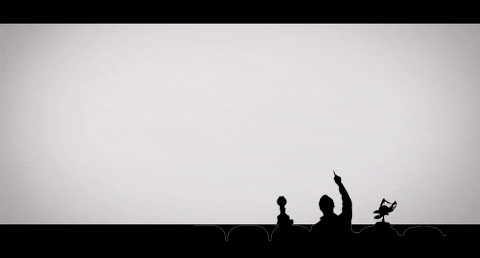

# 6month-training
This Repo Contains all the Projects I did in My Last Semester

# 1. NETFLIX CONSUMPTION ANALYSIS 
present [HERE](https://www.kaggle.com/sahib12/netflix-analysis)

This Notebook contains various Insights and Interesting Patterns of Binge watching that people have adopted
Since 2008 That Includes:-
- [x] Penetration Of **Netflix** in Globally from 2008.
- [x] Preferrable Movie Duration of People In Different countries.
- [x] Countries for which **NETFLIX** makes **most** of the content.

.... and other very interesting insights.

# 2. Custom Document Embeddings Techniques.

So this project was personally my favorite instead of using **DOC2VEC** from **GENSIM** One day I thought of Creating my own 
**DOCUMENT EMBEDDINGS**.

Implemented [here](https://www.kaggle.com/sahib12/document-embedding-techniques)

In this project I Tried to Use **TFIDF**(i.e Term Frequency and Inverse Document Frequency) and
**Word2vec** from **Google** I didn't Trained **Word2vec** on my Training Data(Just wanted to See the Results).

These Techniques were :-

## Technique1 :-
I tried to try to use word2vec for each word embeddings in a sentences and then sum those embedding to get document embedding for that document.

## Technique 2
I used TfIdf for finding weight of each word in a document and then multiplied it to word vector created by word2vec for that word
And finally summed all word vectors to get document embedding for that document.

### Surprisingly These Techniques Got me in Top 30 % of this [Competition](https://www.kaggle.com/c/nlp-getting-started)

