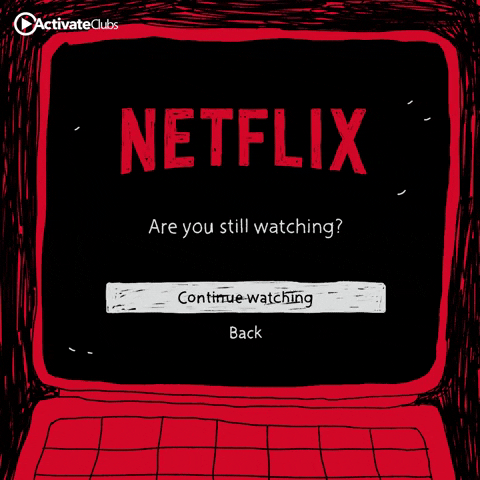

# 6-month-Training
This Repo Contains all the Projects 4 I did in My Last Semester.

# 1. NETFLIX CONSUMPTION ANALYSIS 
Implemented  [HERE](https://www.kaggle.com/sahib12/netflix-analysis)

This Notebook contains various Insights and Interesting Patterns of Binge watching that people have adopted
Since 2008 That Includes:-
- [x] Penetration Of **Netflix** in Globally from 2008.
- [x] Preferrable Movie Duration of People In Different countries.
- [x] Countries for which **NETFLIX** makes **most** of the content.

.... and other very interesting insights.

# 2. Custom Document Embeddings Techniques.

So this project was personally my favorite instead of using **DOC2VEC** from **GENSIM** One day I thought of Creating my own 
**DOCUMENT EMBEDDINGS**.

Implemented [here](https://www.kaggle.com/sahib12/document-embedding-techniques)

In this project I Tried to Use **TFIDF**(i.e Term Frequency and Inverse Document Frequency) and
**Word2vec** from **Google** I didn't Trained **Word2vec** on my Training Data(Just wanted to See the Results).

### OK What is TFIDF?
To read about **TFIDF** refer [here](https://towardsdatascience.com/natural-language-processing-feature-engineering-using-tf-idf-e8b9d00e7e76)

## And What is Word2Vec?
Please Read This Blog this will help you to Understand word2vec
[here](https://www.freecodecamp.org/news/how-to-get-started-with-word2vec-and-then-how-to-make-it-work-d0a2fca9dad3/)

for more detailed explaination check [this](http://mccormickml.com/2016/04/19/word2vec-tutorial-the-skip-gram-model/)

These Techniques were :-

## Technique1 :-
I tried to try to use word2vec for each word embeddings in a sentences and then sum those embedding to get document embedding for that document.

## Technique 2
I used TfIdf for finding weight of each word in a document and then multiplied it to word vector created by word2vec for that word
And finally summed all word vectors to get document embedding for that document.

### Surprisingly These Techniques Got me in Top 30 % of this [Competition](https://www.kaggle.com/c/nlp-getting-started)

# 3. Disaster Or Not. Tweet Classification.
#### Task :-

> Twitter has become an important communication channel in times of emergency.
> The ubiquitousness of smartphones enables people to announce an emergency they’re observing in real-time. Because of this,  more agencies are interested in programatically monitoring Twitter (i.e. disaster relief organizations and news agencies).

**But, it’s not always clear whether a person’s words are actually announcing a disaster. Take this example:**

The author explicitly uses the word **“ABLAZE”** but means it metaphorically. This is clear to a human right away, especially with the visual aid. But it’s less clear to a machine.

And For **Data Visualisation** and For **Beginners** I made Notebook [Here](PROJECT-3/nlp-starter-for-beginners.ipynb)

and This was My Improved Attempt Below
#### Implemented [here](https://www.kaggle.com/sahib12/nlp-starter-for-beginners)

**To Download code is [Here](PROJECT-3/nbsvm-for-twitter-comment-classification.ipynb)**

#### Data available [here](PROJECT-3/nlp-getting-started)  

#### **Future Task**
> Wantto Improve this approach and Make It **Multilingual Text Classification** for **Tweets**.

# 4.RSNA Intracranial Hemorrhage Detection

**Intracranial hemorrhage**, bleeding that occurs inside the cranium, is a serious health problem requiring rapid and often intensive medical treatment. For example, intracranial hemorrhages account for approximately 10% of strokes in the U.S., where stroke is the fifth-leading cause of death. Identifying the location and type of any hemorrhage present is a critical step in treating the patient.

Diagnosis requires an urgent procedure. When a patient shows acute neurological symptoms such as severe headache or loss of consciousness, highly trained specialists review medical images of the patient’s cranium to look for the presence, location and type of hemorrhage. The process is complicated and often time consuming.
So Here I have build an algorithm to detect acute intracranial hemorrhage and its subtypes.

